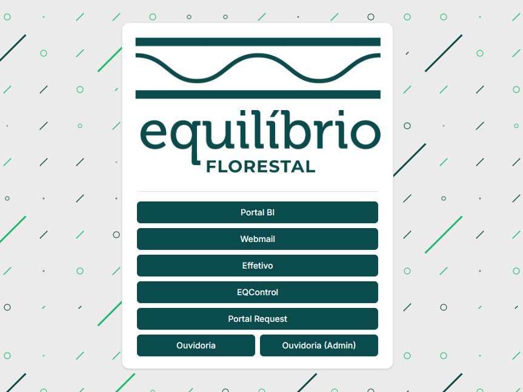
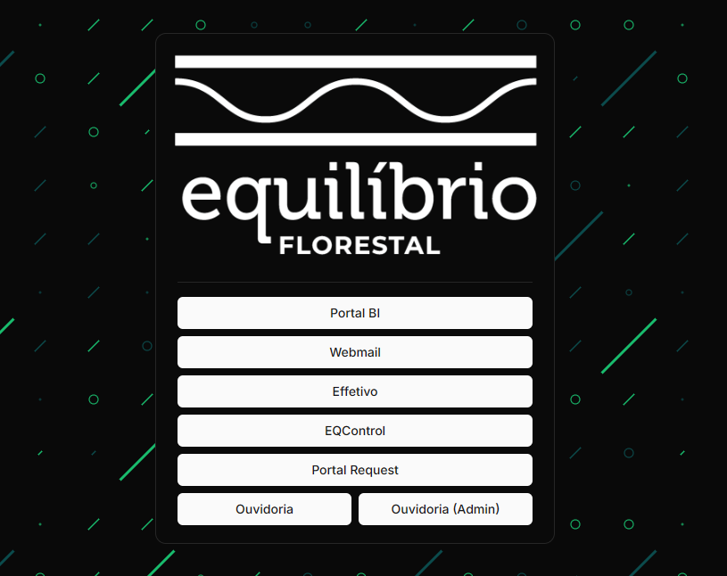

This is a [Next.js](https://nextjs.org/) project bootstrapped with [`create-next-app`](https://github.com/vercel/next.js/tree/canary/packages/create-next-app).

## Iniciar aplicação

Para iniciar uma nova instância da aplicação no **terminal** do sistema operacional.
```bash
git clone <url-repositorio>

cd ./portal-equilibrio-florestal

npm i

npm run build

npm run start
```

Para iniciar uma nova instância via **docker**.
```bash
git clone <url-repositorio>

cd ./portal-equilibrio-florestal

docker build -t <nome-instancia> .

docker run -it -p 4000:3000 <nome-instancia>
```

## Imagens

Os temas são ativados conforme o sistema do usuário, não permitindo ativação manual do tema claro ou escuro.

### Modo claro


### Modo escuro
